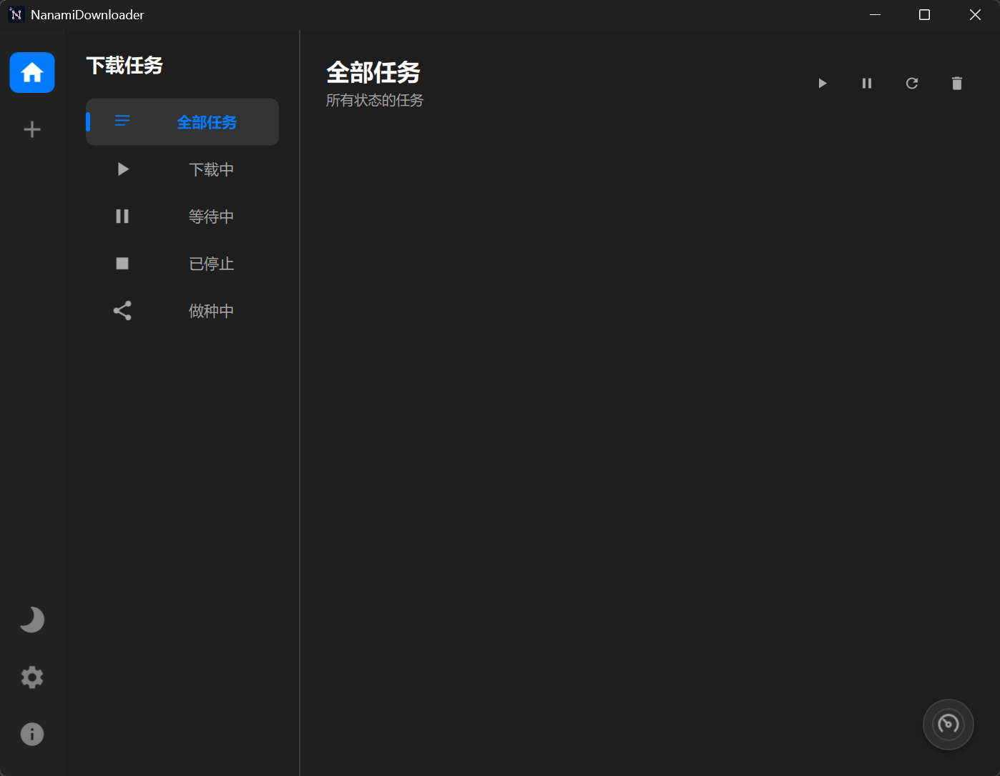
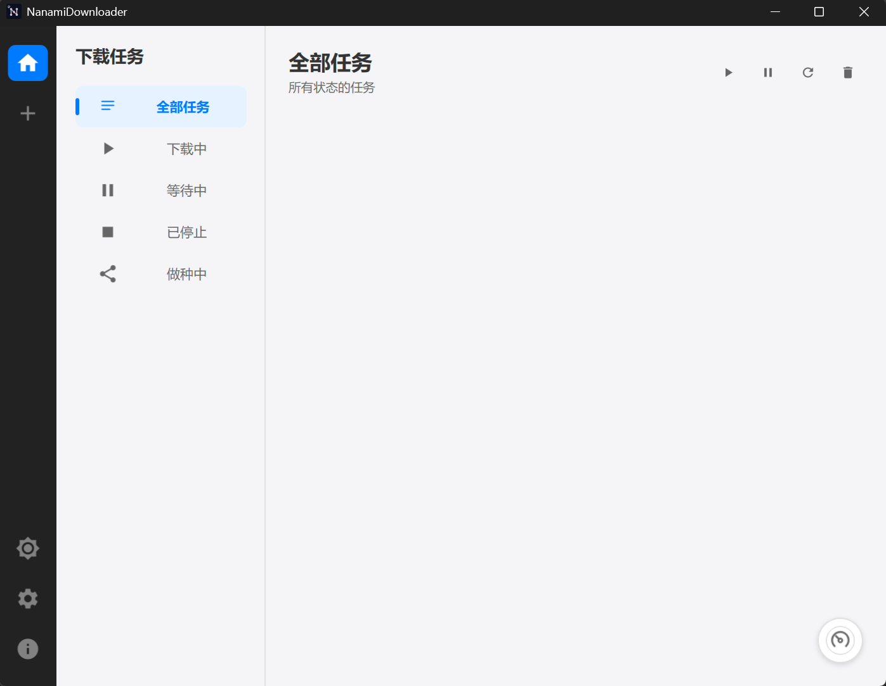

# NanamiDownloader

<p align="center">
  
</p>

<p align="center">
  <a href="LICENSE"></a>
  <a href="#"></a>
  <a href="#"></a>
  <a href="#"></a>
</p>
NanamiDownloader 是一款基于 C++20 和 Qt6/QML 开发的现代化下载工具。它整合了业界多个成熟的开源下载内核，旨在提供简洁高效的下载体验。

> ~~（这是我第一次做项目，其实主要是做给我自己使用，暂时只支持 Windows 平台，其他平台咕咕咕 🕊️）~~

简体中文 | [English](docs/README_en.md)

## ✨ 核心特性

### 📥 全能下载引擎
本项目集成了现有的优秀开源库，支持多种协议：
- **HTTP/HTTPS/FTP**: 调用 **Aria2** 进行文件下载，支持多线程分块下载和断点续传。
- **BT/磁力链接**: 内置 **Libtorrent** 库，原生支持解析磁力链接 (Magnet) 和 .torrent 文件，支持 DHT 网络。
- **流媒体视频**: 调用 **N_m3u8DL-RE**，自动嗅探并下载 M3U8 格式的流媒体，下载完成后自动合并。

### ☁️ 云盘挂载助手
内置了部分云盘的挂载与管理功能（需在“高级设置”中手动开启）：
- **百度网盘**: 支持 Refresh Token 登录，挂载云盘目录。（百度网盘 SVIP 用户可享高速下载）。
- **迅雷云盘**: 支持账号密码登录，挂载云盘目录。

### 🖥️ 现代化交互
- **简洁界面**: 基于 Qt Quick (QML) 构建，界面设计致敬了 **[Motrix](https://motrix.app/)**，力求整洁美观。
- **主题切换**: 完美支持浅色/深色模式，适应不同使用环境。
- **智能辅助**:
    - 📋 **剪贴板监听**: 自动识别复制的下载链接。
    - 🖥️ **系统托盘**: 支持最小化到托盘运行，后台静默下载。

### ⚙️ 高级配置
- **网络代理**: 支持为不同内核分别配置 HTTP/SOCKS5 代理。
- **任务管理**: 支持任务的暂停、恢复、移除（可选保留文件）、打开文件位置。
- **性能调优**: 开放内核参数调整，如全局限速、最大连接数、User-Agent 伪装等。

## 📸 界面预览

| 暗色主题 | 亮色主题 |
| :---: | :---: |
|  |  |

## 📦 安装与使用

1. 前往 **[Releases](../../releases)** 页面下载最新的安装包。
2. 运行安装程序完成安装。
3. 启动软件，建议在“基础设置”中确认默认下载路径。
4. **可选**: 如需使用网盘功能，请在“高级设置” -> “网盘挂载”中开启并配置。

## 🔨 源码构建

如果您想从源码编译本项目：

### 依赖环境
- **C++ 编译器**: 支持 C++20 标准 (推荐 MSVC 2019+ 或 MinGW)。
- **Qt**: 版本 6.10.1 或更高。
- **CMake**: 3.16+。
- **vcpkg**: 推荐使用 vcpkg 管理第三方依赖。

### 构建步骤

1. **克隆仓库**:
   ```bash
   git clone https://github.com/NanamiKyoka/NanamiDownloader.git
   cd NanamiDownloader
   ```

2. **安装依赖 (使用 vcpkg)**:
   ```bash
   # 请根据您的编译器环境选择对应的 triplet
   vcpkg install libtorrent[openssl] boost openssl --triplet x64-mingw-dynamic
   ```

3. **CMake 配置与编译**:
   请确保环境变量中已设置 `QT_ROOT` 和 `VCPKG_ROOT`。
   
   ```bash
   mkdir build && cd build
   # 注意替换您的 vcpkg toolchain 文件路径
   cmake .. -DCMAKE_BUILD_TYPE=Release -DCMAKE_TOOLCHAIN_FILE=[path/to/vcpkg.cmake]
   cmake --build . --config Release
   ```
   
4. **部署外部工具**:
   程序运行依赖以下外部可执行文件。请将它们放入编译产物的 `bin` 目录中（或者放入项目根目录下的 `/third_party/bin`，CMake 会尝试自动复制）：
    - `aria2c.exe`
    - `ffmpeg.exe`
    - `N_m3u8DL-RE.exe`

## 📄 致谢与许可

本项目采用 **GPLv3** 开源协议。

本项目的实现离不开以下优秀的开源项目：

- **[Qt Framework](https://www.qt.io)** (LGPL v3)
- **[Libtorrent (Rasterbar)](https://github.com/arvidn/libtorrent)** (BSD)
- **[Aria2](https://github.com/aria2/aria2)** (GPLv2+)
- **[FFmpeg](https://ffmpeg.org)** (GPL v3)
- **[N_m3u8DL-RE](https://github.com/nilaoda/N_m3u8DL-RE)** (MIT)
- **[OpenSSL](https://www.openssl.org)** (Apache 2.0)
- **[Boost](https://www.boost.org)** (Boost Software License)

详细的第三方组件信息和许可证声明请查看 [NOTICE](NOTICE) 文件。

---

## ⚠️ 免责声明

**NanamiDownloader** 仅作为技术学习与交流工具，供用户合法地下载互联网资源。

1. 本软件**不会**收集任何用户隐私信息。
2. 用户使用本软件下载的所有资源版权归原作者或其合法持有人所有。
3. 开发者不对用户使用本软件下载的内容负责，也不对因使用本软件可能导致的任何损失或损害承担责任。
4. 本软件的网盘挂载功能仅用于方便用户管理**自己的**合法数据，不得用于侵犯他人知识产权或进行非法传播。

**使用本软件即表示您已阅读并同意本免责声明的所有条款。**