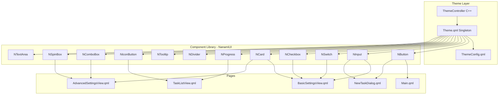
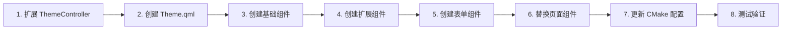

# NanamiDownloader UI 组件统一重构计划

## 一、项目背景

当前项目中存在大量重复的 UI 组件定义，分散在各个 QML 文件中作为 inline component。这导致：
- 代码重复，维护困难
- 样式不一致风险
- 主题切换时可能出现视觉不一致

本计划旨在：
1. 重构现有主题系统，支持完整的 Ant Design 风格
2. 创建统一的 NanamiUI 组件库
3. 制定渐进式组件替换计划
4. 优化 CMake 构建配置

---

## 二、当前主题系统分析

### 2.1 现有 ThemeController (C++)

**文件位置**: [`src/UI/ThemeController.h`](src/UI/ThemeController.h) / [`src/UI/ThemeController.cpp`](src/UI/ThemeController.cpp)

**现有属性**:
| 属性名 | 类型 | 说明 |
|--------|------|------|
| `isDark` | bool | 明暗主题标志 |
| `background` | QColor | 背景色 |
| `surface` | QColor | 表面色（卡片背景） |
| `textPrimary` | QColor | 主要文字颜色 |
| `textSecondary` | QColor | 次要文字颜色 |
| `accent` | QColor | 强调色 |
| `divider` | QColor | 分隔线颜色 |
| `sidebar` | QColor | 侧边栏颜色 |

**问题**: 颜色定义不够完整，缺少 Ant Design 规范的完整色板。

### 2.2 现有重复组件统计

| 组件类型 | 出现位置 | 定义次数 |
|----------|----------|----------|
| InputBackground | NewTaskDialog.qml | 1 |
| SettingCard | BasicSettingsView.qml, AdvancedSettingsView.qml | 2 |
| CustomSwitch / BlueSwitch | 多处 | 3 |
| CustomCheckBox | CloseConfirmDialog.qml, AdvancedSettingsView.qml | 2 |
| SettingInput | BasicSettingsView.qml | 1 |
| IconButton | TaskListView.qml | 1 |
| ActionButtons | AdvancedSettingsView.qml | 1 |
| SpeedInputRow | AdvancedSettingsView.qml | 1 |
| StandardSpinBoxRow | AdvancedSettingsView.qml | 1 |
| CustomComboBoxRow | AdvancedSettingsView.qml | 1 |
| NormalInputRow | AdvancedSettingsView.qml | 1 |
| SidebarButton | Sidebar.qml | 1 |
| StatusIcon | TaskListView.qml | 1 |

---

## 三、重构方案

### 3.1 主题系统重构

#### 3.1.1 扩展 ThemeController 颜色属性

**目标**: 引入 Ant Design 色板系统

**新增颜色属性**:

```cpp
// 基础色板
Q_PROPERTY(QColor primary READ primary NOTIFY themeChanged)           // 主色 #1890ff
Q_PROPERTY(QColor success READ success NOTIFY themeChanged)           // 成功色 #52c41a
Q_PROPERTY(QColor warning READ warning NOTIFY themeChanged)           // 警告色 #faad14
Q_PROPERTY(QColor error READ error NOTIFY themeChanged)               // 错误色 #ff4d4f
Q_PROPERTY(QColor info READ info NOTIFY themeChanged)                 // 信息色 #1890ff

// 文字色
Q_PROPERTY(QColor textPrimary READ textPrimary NOTIFY themeChanged)   // 主文字
Q_PROPERTY(QColor textSecondary READ textSecondary NOTIFY themeChanged) // 次文字
Q_PROPERTY(QColor textDisabled READ textDisabled NOTIFY themeChanged) // 禁用文字
Q_PROPERTY(QColor textHint READ textHint NOTIFY themeChanged)         // 提示文字

// 背景色
Q_PROPERTY(QColor background READ background NOTIFY themeChanged)     // 页面背景
Q_PROPERTY(QColor surface READ surface NOTIFY themeChanged)           // 组件背景
Q_PROPERTY(QColor surfaceVariant READ surfaceVariant NOTIFY themeChanged) // 变体背景
Q_PROPERTY(QColor elevated READ elevated NOTIFY themeChanged)         // 浮起背景

// 边框色
Q_PROPERTY(QColor divider READ divider NOTIFY themeChanged)           // 分隔线
Q_PROPERTY(QColor border READ border NOTIFY themeChanged)             // 边框
Q_PROPERTY(QColor borderFocus READ borderFocus NOTIFY themeChanged)   // 聚焦边框

// 特殊色
Q_PROPERTY(QColor sidebar READ sidebar NOTIFY themeChanged)           // 侧边栏
Q_PROPERTY(QColor hover READ hover NOTIFY themeChanged)               // 悬停背景
Q_PROPERTY(QColor pressed READ pressed NOTIFY themeChanged)           // 按下背景
Q_PROPERTY(QColor disabled READ disabled NOTIFY themeChanged)         // 禁用背景
```

#### 3.1.2 创建 Theme.qml 单例

**文件位置**: `src/UI/Components/Theme.qml`

**职责**: 
- 作为 QML 端的主题单例
- 提供主题切换动画配置
- 提供尺寸、间距、圆角等设计 Token

```qml
// src/UI/Components/Theme.qml
pragma Singleton
import QtQuick 2.15

QtObject {
    // 颜色由 ThemeController 提供，通过 Theme.* 访问
    
    // 尺寸 Token
    readonly property int borderRadiusSmall: 4
    readonly property int borderRadiusMedium: 6
    readonly property int borderRadiusLarge: 8
    readonly property int borderRadiusXLarge: 12
    
    // 间距 Token
    readonly property int spacingXS: 4
    readonly property int spacingSM: 8
    readonly property int spacingMD: 12
    readonly property int spacingLG: 16
    readonly property int spacingXL: 20
    readonly property int spacingXXL: 24
    
    // 字号 Token
    readonly property int fontXS: 10
    readonly property int fontSM: 12
    readonly property int fontMD: 13
    readonly property int fontLG: 14
    readonly property int fontXL: 16
    readonly property int fontXXL: 18
    readonly property int fontTitle: 20
    readonly property int fontTitleLarge: 24
    
    // 组件尺寸 Token
    readonly property int inputHeight: 36
    readonly property int buttonHeight: 32
    readonly property int buttonHeightLarge: 40
    readonly property int iconSize: 18
    readonly property int iconSizeLarge: 22
    
    // 动画时长 Token
    readonly property int durationFast: 100
    readonly property int durationNormal: 200
    readonly property int durationSlow: 300
}
```

### 3.2 NanamiUI 组件库设计

#### 3.2.1 目录结构

```
src/UI/Components/
├── Theme.qml              # 主题单例（设计 Token）
├── ThemeConfig.qml        # 兼容层（连接 ThemeController）
├── qmldir                 # 组件注册文件
├── NButton.qml            # 按钮组件
├── NInput.qml             # 输入框组件
├── NSwitch.qml            # 开关组件
├── NCheckbox.qml          # 复选框组件
├── NCard.qml              # 卡片组件
├── NProgress.qml          # 进度条组件
├── NDivider.qml           # 分隔线组件
├── NTooltip.qml           # 工具提示组件
├── NBadge.qml             # 徽标组件
├── NSpin.qml              # 加载指示器组件
├── NComboBox.qml          # 下拉框组件
├── NSpinBox.qml           # 数字输入框组件
├── NTextArea.qml          # 多行文本框组件
├── NDialog.qml            # 对话框组件
├── NIconButton.qml        # 图标按钮组件
├── NMenu.qml              # 菜单组件
└── NToast.qml             # 消息提示组件
```

#### 3.2.2 qmldir 文件

```
# src/UI/Components/qmldir
module Nanami.UI.Components
singleton Theme 1.0 Theme.qml
ThemeConfig 1.0 ThemeConfig.qml
NButton 1.0 NButton.qml
NInput 1.0 NInput.qml
NSwitch 1.0 NSwitch.qml
NCheckbox 1.0 NCheckbox.qml
NCard 1.0 NCard.qml
NProgress 1.0 NProgress.qml
NDivider 1.0 NDivider.qml
NTooltip 1.0 NTooltip.qml
NBadge 1.0 NBadge.qml
NSpin 1.0 NSpin.qml
NComboBox 1.0 NComboBox.qml
NSpinBox 1.0 NSpinBox.qml
NTextArea 1.0 NTextArea.qml
NDialog 1.0 NDialog.qml
NIconButton 1.0 NIconButton.qml
NMenu 1.0 NMenu.qml
NToast 1.0 NToast.qml
```

#### 3.2.3 核心组件设计

##### NButton.qml

```qml
import QtQuick
import QtQuick.Controls
import QtQuick.Layouts

Button {
    id: root
    
    // 属性定义
    property string variant: "default"  // default, primary, dashed, text, link
    property string size: "middle"      // small, middle, large
    property bool loading: false
    property string iconSource: ""
    property color iconColor: Theme.textPrimary
    
    // 尺寸映射
    readonly property var sizeMap: ({
        "small": { height: 24, fontSize: Theme.fontSM, padding: Theme.spacingSM },
        "middle": { height: Theme.buttonHeight, fontSize: Theme.fontMD, padding: Theme.spacingMD },
        "large": { height: Theme.buttonHeightLarge, fontSize: Theme.fontLG, padding: Theme.spacingLG }
    })
    
    implicitHeight: sizeMap[size].height
    implicitWidth: contentRow.implicitWidth + sizeMap[size].padding * 2
    
    // 样式根据 variant 变化
    background: Rectangle {
        radius: Theme.borderRadiusMedium
        color: {
            if (!root.enabled) return Theme.disabled
            switch(root.variant) {
                case "primary": return root.pressed ? Qt.darker(Theme.primary, 1.1) : Theme.primary
                case "dashed": return "transparent"
                case "text": case "link": return root.hovered ? Theme.hover : "transparent"
                default: return root.hovered ? Theme.hover : Theme.surface
            }
        }
        border.color: {
            if (root.variant === "dashed") return Theme.border
            if (root.variant === "default") return root.hovered ? Theme.primary : Theme.border
            return "transparent"
        }
        border.width: root.variant === "dashed" || root.variant === "default" ? 1 : 0
        
        Behavior on color { ColorAnimation { duration: Theme.durationFast } }
        Behavior on border.color { ColorAnimation { duration: Theme.durationFast } }
    }
    
    contentItem: RowLayout {
        id: contentRow
        spacing: Theme.spacingXS
        
        // Loading 指示器
        NSpin { visible: root.loading; running: root.loading; size: root.size }
        
        // 图标
        Image {
            visible: root.iconSource !== "" && !root.loading
            source: root.iconSource
            sourceSize.width: Theme.iconSize
            sourceSize.height: Theme.iconSize
            layer.enabled: true
            layer.effect: ColorOverlay { color: root.iconColor }
        }
        
        // 文字
        Text {
            text: root.text
            font.pixelSize: sizeMap[size].fontSize
            color: {
                if (!root.enabled) return Theme.textDisabled
                if (root.variant === "primary") return "#ffffff"
                if (root.variant === "link") return Theme.primary
                return Theme.textPrimary
            }
        }
    }
    
    MouseArea {
        anchors.fill: parent
        cursorShape: Qt.PointingHandCursor
        enabled: false
    }
}
```

##### NInput.qml

```qml
import QtQuick
import QtQuick.Controls

TextField {
    id: root
    
    property string size: "middle"
    property string status: "normal"  // normal, error, warning
    property bool allowClear: false
    
    readonly property var sizeMap: ({
        "small": { height: 24, fontSize: Theme.fontSM },
        "middle": { height: Theme.inputHeight, fontSize: Theme.fontMD },
        "large": { height: 40, fontSize: Theme.fontLG }
    })
    
    implicitHeight: sizeMap[size].height
    font.pixelSize: sizeMap[size].fontSize
    color: Theme.textPrimary
    placeholderTextColor: Theme.textHint
    selectionColor: Theme.primary
    selectedTextColor: "#ffffff"
    
    leftPadding: Theme.spacingMD
    rightPadding: allowClear ? Theme.spacingXL : Theme.spacingMD
    
    background: Rectangle {
        color: root.activeFocus ? Theme.surface : Theme.surfaceVariant
        border.color: {
            if (root.status === "error") return Theme.error
            if (root.status === "warning") return Theme.warning
            return root.activeFocus ? Theme.primary : Theme.border
        }
        border.width: root.activeFocus ? 2 : 1
        radius: Theme.borderRadiusMedium
        
        Behavior on border.color { ColorAnimation { duration: Theme.durationFast } }
        Behavior on border.width { NumberAnimation { duration: Theme.durationFast } }
    }
    
    // 清除按钮
    NIconButton {
        visible: root.allowClear && root.text !== ""
        anchors.right: parent.right
        anchors.rightMargin: Theme.spacingXS
        anchors.verticalCenter: parent.verticalCenter
        iconName: "close"
        size: "small"
        variant: "text"
        onClicked: root.text = ""
    }
}
```

##### NSwitch.qml

```qml
import QtQuick
import QtQuick.Controls

Switch {
    id: root
    
    property color checkedColor: Theme.primary
    
    indicator: Rectangle {
        implicitWidth: 44
        implicitHeight: 24
        radius: height / 2
        
        color: root.checked ? root.checkedColor : (Theme.isDark ? "#444" : "#ccc")
        border.width: 0
        
        Behavior on color { ColorAnimation { duration: Theme.durationNormal } }
        
        Rectangle {
            x: root.checked ? parent.width - width - 2 : 2
            y: 2
            width: 20
            height: 20
            radius: height / 2
            color: "#ffffff"
            
            Behavior on x { NumberAnimation { duration: Theme.durationNormal; easing.type: Easing.OutCubic } }
        }
    }
    
    contentItem: Text {
        text: root.text
        font: root.font
        color: Theme.textPrimary
        verticalAlignment: Text.AlignVCenter
        leftPadding: root.indicator.width + root.spacing
    }
}
```

##### NCheckbox.qml

```qml
import QtQuick
import QtQuick.Controls

CheckBox {
    id: root
    
    property color checkedColor: Theme.primary
    
    indicator: Rectangle {
        implicitWidth: 20
        implicitHeight: 20
        radius: Theme.borderRadiusSmall
        
        color: root.checked ? root.checkedColor : "transparent"
        border.color: root.checked ? root.checkedColor : (Theme.isDark ? "#666" : "#bbb")
        border.width: 1.5
        
        Behavior on color { ColorAnimation { duration: Theme.durationFast } }
        Behavior on border.color { ColorAnimation { duration: Theme.durationFast } }
        
        Text {
            anchors.centerIn: parent
            text: "✓"
            font.pixelSize: 14
            font.bold: true
            color: "#ffffff"
            visible: root.checked
        }
    }
    
    contentItem: Text {
        text: root.text
        font: root.font
        color: Theme.textPrimary
        verticalAlignment: Text.AlignVCenter
        leftPadding: root.indicator.width + root.spacing
        wrapMode: Text.WordWrap
    }
}
```

##### NCard.qml

```qml
import QtQuick
import QtQuick.Controls
import QtQuick.Layouts

Rectangle {
    id: root
    
    property string title: ""
    property string desc: ""
    property alias content: contentCol.data
    property bool hoverable: false
    
    default property alias children: contentCol.data
    
    implicitHeight: contentCol.implicitHeight + (title !== "" ? 60 : 30)
    
    color: Theme.surface
    radius: Theme.borderRadiusLarge
    border.color: Theme.divider
    border.width: 1
    
    Behavior on color { ColorAnimation { duration: Theme.durationNormal } }
    
    // 悬停效果
    Rectangle {
        anchors.fill: parent
        radius: parent.radius
        color: Theme.hover
        opacity: mouseArea.containsMouse ? 1 : 0
        visible: root.hoverable
        
        Behavior on opacity { NumberAnimation { duration: Theme.durationFast } }
    }
    
    ColumnLayout {
        id: contentCol
        anchors.fill: parent
        anchors.margins: Theme.spacingXL
        spacing: Theme.spacingXL
        
        // 标题区域
        ColumnLayout {
            Layout.fillWidth: true
            spacing: Theme.spacingXS
            visible: root.title !== ""
            
            Text {
                text: root.title
                font.bold: true
                font.pixelSize: Theme.fontXXL
                color: Theme.textPrimary
                Layout.fillWidth: true
                wrapMode: Text.WordWrap
            }
            
            Text {
                text: root.desc
                font.pixelSize: Theme.fontSM
                color: Theme.textSecondary
                visible: root.desc !== ""
                Layout.fillWidth: true
                wrapMode: Text.WordWrap
            }
        }
        
        NDivider { visible: root.title !== "" }
    }
    
    MouseArea {
        id: mouseArea
        anchors.fill: parent
        hoverEnabled: root.hoverable
        acceptedButtons: Qt.NoButton
    }
}
```

##### NProgress.qml

```qml
import QtQuick

Rectangle {
    id: root
    
    property real value: 0       // 0.0 - 1.0
    property string status: "normal"  // normal, success, error
    property bool showInfo: true
    property string format: "percent"  // percent, custom
    
    implicitHeight: 8
    radius: height / 2
    color: Theme.isDark ? "#444" : "#eee"
    
    Rectangle {
        width: parent.width * Math.max(0, Math.min(1, root.value))
        height: parent.height
        radius: parent.radius
        
        color: {
            switch(root.status) {
                case "success": return Theme.success
                case "error": return Theme.error
                default: return Theme.primary
            }
        }
        
        Behavior on width { NumberAnimation { duration: Theme.durationSlow } }
        Behavior on color { ColorAnimation { duration: Theme.durationNormal } }
    }
}
```

##### NDivider.qml

```qml
import QtQuick

Rectangle {
    id: root
    
    property string orientation: "horizontal"  // horizontal, vertical
    property string text: ""
    property bool dashed: false
    
    implicitHeight: orientation === "horizontal" ? 1 : parent.height
    implicitWidth: orientation === "horizontal" ? parent.width : 1
    
    color: Theme.divider
    
    // 虚线支持可通过 Canvas 实现
}
```

##### NIconButton.qml

```qml
import QtQuick
import QtQuick.Controls

Button {
    id: root
    
    property string iconName: ""
    property string size: "middle"
    property string variant: "default"
    property color iconColor: Theme.textSecondary
    
    readonly property var sizeMap: ({
        "small": { size: 14, buttonSize: 24 },
        "middle": { size: Theme.iconSize, buttonSize: 32 },
        "large": { size: Theme.iconSizeLarge, buttonSize: 40 }
    })
    
    implicitWidth: sizeMap[size].buttonSize
    implicitHeight: sizeMap[size].buttonSize
    
    display: AbstractButton.IconOnly
    
    icon.source: iconName
    icon.color: {
        if (!enabled) return Theme.textDisabled
        if (variant === "primary") return "#ffffff"
        return iconColor
    }
    icon.width: sizeMap[size].size
    icon.height: sizeMap[size].size
    
    background: Rectangle {
        radius: Theme.borderRadiusMedium
        color: {
            if (!root.enabled) return Theme.disabled
            if (root.variant === "primary") return root.pressed ? Qt.darker(Theme.primary, 1.1) : Theme.primary
            return root.hovered ? Theme.hover : "transparent"
        }
        
        Behavior on color { ColorAnimation { duration: Theme.durationFast } }
    }
    
    MouseArea {
        anchors.fill: parent
        cursorShape: Qt.PointingHandCursor
        enabled: false
    }
}
```

### 3.3 CMake 配置更新

#### 3.3.1 注释 WINDEPLOYQT_EXECUTABLE

**修改文件**: [`CMakeLists.txt`](CMakeLists.txt)

**修改内容**: 注释掉第 108-127 行的 WINDEPLOYQT_EXECUTABLE 相关代码

```cmake
# 注释掉以下代码块
# if (CMAKE_BUILD_TYPE STREQUAL "Release")
#     find_program(WINDEPLOYQT_EXECUTABLE windeployqt HINTS ${QT_ROOT}/bin)
#     ...
# endif ()
```

#### 3.3.2 添加 third_party/dll 复制

**修改文件**: [`cmake/copy_third_party.cmake`](cmake/copy_third_party.cmake)

```cmake
execute_process(COMMAND ${CMAKE_COMMAND} -E make_directory ${TARGET_DIR})

# 从 bin 目录复制
set(FILE_LIST
    "aria2c.exe"
    "ffmpeg.exe" 
    "N_m3u8DL-RE.exe"
)

foreach(FILE_NAME ${FILE_LIST})
    set(SOURCE_FILE "${SOURCE_DIR}/../bin/${FILE_NAME}")
    set(TARGET_FILE "${TARGET_DIR}/${FILE_NAME}")
    
    if(EXISTS "${SOURCE_FILE}")
        execute_process(
            COMMAND ${CMAKE_COMMAND} -E copy_if_different "${SOURCE_FILE}" "${TARGET_FILE}"
        )
        message(STATUS "Copied ${FILE_NAME} to build directory")
    else()
        message(STATUS "File ${FILE_NAME} not found at ${SOURCE_FILE}, skipping copy")
    endif()
endforeach()

# 从 dll 目录复制
set(DLL_SOURCE_DIR "${SOURCE_DIR}/../dll")

if(EXISTS "${DLL_SOURCE_DIR}")
    file(GLOB DLL_FILES "${DLL_SOURCE_DIR}/*.dll")
    
    foreach(DLL_FILE ${DLL_FILES})
        get_filename_component(DLL_NAME ${DLL_FILE} NAME)
        set(TARGET_FILE "${TARGET_DIR}/${DLL_NAME}")
        
        execute_process(
            COMMAND ${CMAKE_COMMAND} -E copy_if_different "${DLL_FILE}" "${TARGET_FILE}"
        )
        message(STATUS "Copied ${DLL_NAME} to build directory")
    endforeach()
else()
    message(STATUS "DLL directory ${DLL_SOURCE_DIR} not found, skipping DLL copy")
endif()
```

---

## 四、组件替换计划

### 4.1 第一阶段：基础组件库创建

| 任务 | 文件 | 说明 |
|------|------|------|
| 创建 Theme.qml | src/UI/Components/Theme.qml | 设计 Token 单例 |
| 创建 ThemeConfig.qml | src/UI/Components/ThemeConfig.qml | 兼容层 |
| 创建 qmldir | src/UI/Components/qmldir | 组件注册 |
| 创建 NButton.qml | src/UI/Components/NButton.qml | 按钮组件 |
| 创建 NInput.qml | src/UI/Components/NInput.qml | 输入框组件 |
| 创建 NSwitch.qml | src/UI/Components/NSwitch.qml | 开关组件 |
| 创建 NCheckbox.qml | src/UI/Components/NCheckbox.qml | 复选框组件 |
| 创建 NCard.qml | src/UI/Components/NCard.qml | 卡片组件 |

### 4.2 第二阶段：扩展组件创建

| 任务 | 文件 | 说明 |
|------|------|------|
| 创建 NProgress.qml | src/UI/Components/NProgress.qml | 进度条组件 |
| 创建 NDivider.qml | src/UI/Components/NDivider.qml | 分隔线组件 |
| 创建 NTooltip.qml | src/UI/Components/NTooltip.qml | 工具提示组件 |
| 创建 NBadge.qml | src/UI/Components/NBadge.qml | 徽标组件 |
| 创建 NSpin.qml | src/UI/Components/NSpin.qml | 加载指示器 |
| 创建 NIconButton.qml | src/UI/Components/NIconButton.qml | 图标按钮 |

### 4.3 第三阶段：表单组件创建

| 任务 | 文件 | 说明 |
|------|------|------|
| 创建 NComboBox.qml | src/UI/Components/NComboBox.qml | 下拉框组件 |
| 创建 NSpinBox.qml | src/UI/Components/NSpinBox.qml | 数字输入框 |
| 创建 NTextArea.qml | src/UI/Components/NTextArea.qml | 多行文本框 |

### 4.4 第四阶段：页面组件替换

| 任务 | 涉及文件 | 替换内容 |
|------|----------|----------|
| 替换 BasicSettingsView | BasicSettingsView.qml | SettingCard → NCard, CustomSwitch → NSwitch, CustomCheckBox → NCheckbox, SettingInput → NInput |
| 替换 AdvancedSettingsView | AdvancedSettingsView.qml | 同上 + SpeedInputRow → NInput, StandardSpinBoxRow → NSpinBox, CustomComboBoxRow → NComboBox |
| 替换 NewTaskDialog | NewTaskDialog.qml | InputBackground → NInput, CheckBox → NCheckbox, Button → NButton |
| 替换 CloseConfirmDialog | CloseConfirmDialog.qml | CustomCheckBox → NCheckbox, Button → NButton |
| 替换 TaskListView | TaskListView.qml | IconButton → NIconButton, 进度条 → NProgress |
| 替换 Sidebar | Sidebar.qml | SidebarButton → NIconButton |
| 替换 Main.qml | Main.qml | toast → NToast, MenuBtn → NIconButton |

### 4.5 第五阶段：CMake 配置更新

| 任务 | 文件 | 说明 |
|------|------|------|
| 注释 WINDEPLOYQT | CMakeLists.txt | 注释 108-127 行 |
| 更新 copy_third_party | cmake/copy_third_party.cmake | 添加 dll 目录复制 |
| 更新 CMakeLists 组件注册 | CMakeLists.txt | 添加 Components 目录到资源 |

---

## 五、架构图



---

## 六、执行顺序



---

## 七、风险评估

| 风险 | 影响 | 缓解措施 |
|------|------|----------|
| 主题切换动画不连贯 | 中 | 使用 Behavior 和 ColorAnimation 确保平滑过渡 |
| 组件 API 不兼容 | 高 | 保留原有属性名，添加适配层 |
| 性能影响 | 低 | 组件使用轻量级实现，避免复杂计算 |
| 现有功能回退 | 高 | 分阶段替换，每阶段进行测试 |

---

## 八、验收标准

1. **主题系统**
   - 明暗主题切换流畅，无闪烁
   - 所有颜色符合 Ant Design 规范
   - Theme.qml 提供完整的设计 Token

2. **组件库**
   - 所有组件支持主题感知
   - 组件 API 符合 Ant Design 规范
   - 组件可复用于新页面

3. **构建配置**
   - CMake 构建成功
   - third_party/bin 和 third_party/dll 正确复制
   - 运行时无缺失 DLL 错误

4. **功能验证**
   - 所有现有功能正常工作
   - UI 视觉一致性提升